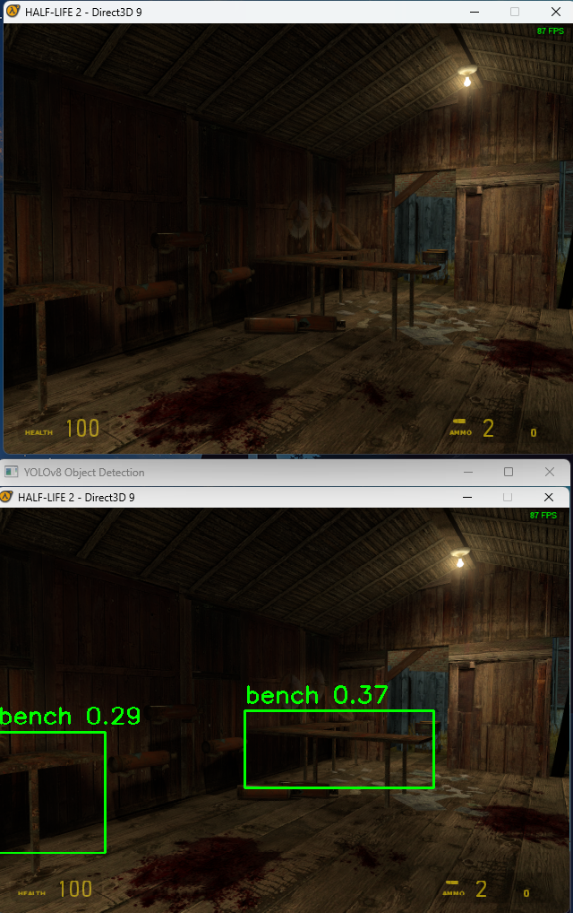

# YOLOv8 Object Recognition Bot for Video Games

## Overview

This repository contains a proof of concept (PoC) script for an AI bot that can perform simple actions in a video game based on object recognition. The script utilizes the YOLOv8 model for real-time object detection and recognition. It captures the game screen, detects objects, and performs actions such as moving the mouse and pressing keyboard keys based on the detected objects.

## Example: Bot in Action

Here is an example of the bot in action in Half-Life 2. The top image shows the in-game view, and the bottom image shows the YOLOv8 object detection view.



In the top image, you can see the player's view in the game with the crosshair centered. The bottom image is the output from the bot's object detection using YOLOv8. The bot detects objects in the game, in this case, identifying multiple "bench" objects with their respective confidence levels. 

This demonstrates the bot's ability to recognize and label objects in real-time, providing visual feedback and enabling future actions based on these detections.


## Features

- **Real-time Object Detection**: Uses the YOLOv8 model to detect objects in the game screen in real-time.
- **Mouse Movement**: Moves the mouse towards detected objects (persons) with a confidence threshold of 70%.
- **Keyboard Input**: Simulates key presses (e.g., walking forward) when a person is detected with a confidence threshold of 70%.
- **Multithreading**: Utilizes multiple threads to handle object detection, mouse movement, and keyboard input independently, ensuring smooth operation.
- **Adjustable Screen Capture**: Captures a specific region of the screen to improve performance and focus on the game window.
- **Adjustable Confidence Thresholds**: Configurable confidence thresholds for triggering actions based on object detection.

## Requirements

- Python 3.x
- OpenCV
- NumPy
- PIL (Pillow)
- screeninfo
- ultralytics
- pynput
- pyautogui

## Installation

1. Clone the repository:
    ```sh
    git clone https://github.com/allend2092/YOLOv8_Half-Life2_bot.git
    cd YOLOv8_Half-Life2_bot
    ```

2. Install the required Python packages:
    ```sh
    pip install opencv-python-headless numpy pillow screeninfo ultralytics pynput pyautogui
    ```

3. Download the YOLOv8 model file (`yolov8x.pt`) and place it in the same directory as the script.

## Usage

1. **Enable Developer Console and Set Up Key Binds**:
    - Enable the developer console in your game (e.g., Half-Life 2) and set up key binds for actions such as spawning a Combine soldier and hiding the crosshair and weapon model.

2. **Run the Script**:
    ```sh
    python your_script_name.py
    ```

3. **Game Setup**:
    - Ensure the game is running in a windowed mode with a resolution of 640x480 in the upper right section of the screen.
    - Disable the crosshair with the console command `crosshair 0`.
    - Hide the weapon model with the console command `r_drawviewmodel 0`.

## Script Details

The script captures the game screen, uses YOLOv8 for object detection, and performs actions based on the detected objects. Here are the key components:

- **Screen Capture**: Captures a specific region of the screen (1280, 0, 1920, 510) to focus on the game window.
- **YOLOv8 Model**: Uses the YOLOv8 model to detect objects in the captured screen region.
- **Mouse Movement**: Moves the mouse towards detected persons with a configurable confidence threshold. Fires the weapon if the detected person is centered on the screen.
- **Keyboard Input**: Simulates walking forward when a person is detected with a configurable confidence threshold.
- **Multithreading**: Runs mouse movement and keyboard input in separate threads to ensure smooth operation.

## Future Improvements

This script is an early proof of concept, and there are several areas for potential improvement:
- **Object Recognition in a Separate Thread**: Move object recognition to a separate thread to further enhance performance.
- **Enhance Detection Accuracy**: Improve the accuracy of object detection by fine-tuning the model or using a more robust model.
- **Additional Actions**: Implement more complex actions based on detected objects, such as dodging or interacting with game elements.

## Author

Daryl A.

## License

This project is licensed under the MIT License. See the [LICENSE](LICENSE) file for details.
